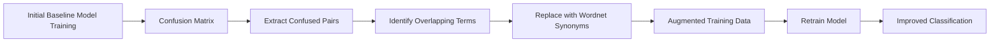

# Automated Clinical Diagnosis Prediction

> **A Comprehensive Dual Approach: Traditional Classification vs. Generative Models**  
> *Masters Research Project - TU Dresden, ScaDS.AI Initiative*

[](https://www.python.org/downloads/)
[](https://pytorch.org/)
[](LICENSE)
[](https://physionet.org/content/mimiciv/)

---

## 📋 Table of Contents

- [Overview](#overview)
- [Project Structure](#project-structure)
- [Dataset](#dataset)
- [Approaches](#approaches)
  - [Classification Models](#classification-models)
  - [Generative Models](#generative-models)
- [Results](#results)
- [Installation](#installation)
- [Quick Start](#quick-start)
- [Detailed Documentation](#detailed-documentation)
- [Citation](#citation)

---

## 🎯 Overview

This project implements and compares **two distinct approaches** for automated clinical diagnosis prediction from discharge summaries:

1. **Traditional and Enchanced Classification** (BioClinicalBERT and DeBERTa-base with improved class balancing and synonym replacement strategies)
2. **Generative Approach** (LoRA-finetuned LLaMA-3-8B)

### Key Achievements

| Approach | Best Model | Primary Metric | Performance |
|----------|------------|----------------|-------------|
| **Classification** | DeBERTa-base + Vocabulary Disambiguation + Class Balancing | Accuracy | **97.4%** |
| **Classification** | Bio_ClinicalBERT + Vocabulary Disambiguation + Class Balancing | Accuracy | **88.2%** |
| **Generation** | LLaMA-3-8B + LoRA (r=8) | Exact Match | **52.0%** |
| **Generation** | LLaMA-3-8B + LoRA (r=8) | Semantic Simarility with BioClinicalBERT Embeddings | **90.7%** |

### Research Innovation

**Misclassification-Driven Vocabulary Disambiguation**: A novel approach that analyzes confusion matrices to identify and replace ambiguous medical terms, achieving **36.33 percentage point improvement** over traditional weighted loss methods.

---

## 📁 Project Structure
```
automated-clinical-diagnosis-prediction/
│
├── classification/                             # Text Classification Diagnosis Prediction Approaches
│   ├── Baseline-model/                          # 5 Transformer baselines
│   │   ├── BioBERT.py                          # BERT pre-trained on biomedical text
│   │   ├── Bio_ClinicalBERT.py                 # BERT fine-tuned on MIMIC-III
│   │   ├── PubMedBERT.py                       # BERT trained on PubMed abstracts
│   │   ├── deberta-v3-base.py                  # Microsoft DeBERTa-v3 baseline
│   │   ├── Deberta_base_weighted.py            # DeBERTa with class weights
│   │   └── evaluate_deberta_model.py           # Evaluation utilities
│   │
│   └── misclassification-driven-vocabulary-disambiguation/
│       ├── Bio_ClinicalBERT/
│       │   ├── Clinicalbertclassification.sh   # SLURM job script
│       │   └── clinicalbert_classification_training.py # Bio_ClinicalBERT full classification pipeline with class balancing and synonym replacement
│       │
│       └── DeBERTa/                            # ⭐ BEST APPROACH
│           ├── data_augmentation.py            # Synonym-based augmentation
│           ├── job_script.sh                   # HPC cluster submission
│           ├── main.py                         # Full training pipeline
│           ├── main_memory_optimized.py        # Memory-efficient version
│           ├── misclassification_extraction.py # Confusion analysis
│           └── synonym_replacer.py             # Vocabulary disambiguation
│
├── generation/                                  # Text Generation Diagnosis Prediction Approaches
│   ├── css.py                                  # Full training + evaluation
│   ├── cssinference.py                         # Standalone inference
│   ├── cssfinference.py                        # In-memory direct testing
│   ├── finetuningcssimprovedeval.py           # Research-grade metrics
│   ├── lorar8.py                               # LoRA rank=8 config
│   ├── lorar16.py                              # ⭐ LoRA rank=16 (BEST)
│   ├── primary_diag.py                         # Primary diagnosis specialist
│   └── traindafinetuningcss.py                # Quick experimentation
│
└── shared/                                      # Common utilities
    ├── ccs_linked_icdmimic.py                   # Link ICD codes to CCS (Clinical Classifications Software) categories
    ├── counting_ccs.py                          # Count frequency of CCS codes in dataset
    ├── diagnosis_distribution.py                # Analyze distribution of diagnoses across dataset
    ├── diagnosis_mapping.py                     # Create mappings between different diagnosis formats ie. ICD codes, CCS codes, and diagnosis text
    ├── filtering_truncation.py                  # Filter and truncate clinical texts
    ├── final_processing_summary.txt              
    ├── finalhcup_totextcsv.py                   # Merging the Final hcup csv file which is mapped to the 3 merged csv files
    ├── finetuning_gen_datasetdir.py             # For Creating the input csvs directory for generation model fine-tuning for both CSS Description and Primary Description as Output Label Space
    ├── gen_dir_css.py                           # Generate CCS-based directory structure
    ├── hcup_category_analysis.txt            
    ├── hcup_processed_medical_dataset_with_labels.py # For creating the final dataset csv with all the target outputs and merged csvs
    ├── hcupccs.py                               # For downloading the CCS Description for ICD 9 and 10 Coding from official HCUP Website
    ├── merge_medical_data.py                    # for creating a csv from 3 csv from mimic iv containg icd code, description and unstructured discharge summaries and creating 24 structured columns
    └── qaformating.py                           # for the question answering formating in text generation
└── README.md
```

---

## 📊 Dataset

### MIMIC-IV Clinical Database

**Source**: [MIMIC-IV v3.1](https://physionet.org/content/mimiciv/3.1/)  
**Task**: Single-label clinical diagnosis classification from discharge summaries, ICD Code and CCS Description

#### Statistics
```
Total Discharge Summaries: 331,604
Unique Diagnoses (CCS):     538 categories
Average Text Length:        1,247 tokens

Data Split:
├── Training:   265,283 samples (80%)
├── Validation:  33,160 samples (10%)
└── Test:        33,161 samples (10%)
```

#### Data Format
```json
{
  "clinical_text": "The patient is a 65-year-old male with a history of hypertension and diabetes mellitus who presents with acute onset chest pain radiating to the left arm. EKG shows ST elevation in leads II, III, and aVF. Troponin levels are elevated at 2.5 ng/mL...",
  "target": "Acute myocardial infarction",
  "predicted": "Acute myocardial infarction"
}
```

#### Class Distribution

- **Imbalanced**: Top diagnosis (4.2%), Rare diagnoses (<0.1%)
- **Challenge**: Effective handling of class imbalance
- **Solution**: Weighted loss + vocabulary disambiguation

---

## 🔬 Approaches

---

## 1️⃣ Classification Models

### Baseline Transformer Models (5 Pre-trained Models)

All models fine-tuned on MIMIC-IV discharge summaries for 538-class classification.

#### 1.1 BioBERT
- **Base**: `dmis-lab/biobert-v1.1`
- **Pre-training**: PubMed + PMC full-text articles
- **Accuracy**: 46.69%
- **Strengths**: General biomedical language understanding

#### 1.2 Bio_ClinicalBERT
- **Base**: `emilyalsentzer/Bio_ClinicalBERT`
- **Pre-training**: MIMIC-III clinical notes (2M notes)
- **Accuracy**: 45.84%
- **Strengths**: Clinical terminology, abbreviations, patient narratives

#### 1.3 PubMedBERT
- **Base**: `microsoft/BiomedNLP-PubMedBERT-base-uncased-abstract`
- **Pre-training**: PubMed abstracts (14M abstracts)
- **Accuracy**: 46.09%
- **Strengths**: Scientific medical literature, formal terminology

#### 1.4 DeBERTa-v3-base
- **Base**: `microsoft/deberta-v3-base`
- **Pre-training**: General domain (Wikipedia, BookCorpus, etc.)
- **Architecture**: Disentangled attention mechanism
- **Accuracy**: 52.83%
- **Strengths**: Superior architecture, state-of-the-art performance

#### 1.5 DeBERTa-base (Weighted Loss) ⭐
- **Base**: `microsoft/deberta-v3-base`
- **Enhancement**: Class-weighted cross-entropy loss
- **Accuracy**: **61.07%**
- **Strengths**: Handles class imbalance effectively
- **Status**: **Best baseline model**

---

### Advanced: Misclassification-Driven Vocabulary Disambiguation

#### Problems

Problem 1: The pattern- Models struggle with fine-grained distinctions between similar conditions sharing vocabulary.

**Example Confusion Pair**:
```
Diagnosis A: "Acute Myocardial Infarction"
Diagnosis B: "Other/ill-defined heart disease "

Overlapping Terms: {chest pain, cardiac, ischemia, coronary}
→ Model confusion: 521 counts
```

Problem 2: Weighted loss tells the model to care more about rare classes, but it doesn't give the model more examples to learn

#### Solution: Vocabulary Disambiguation Pipeline

**4-Step Process**:


#### Implementation Files
```python
# 1. Extract confused pairs
python misclassification_extraction.py \
    --confusion_matrix baseline_confusion.npy \
    --output confused_pairs.json

# 2. Replace vocabulary
python synonym_replacer.py \
    --extract the top K synonyms \
    --replace them using WORDNET Synonyms

# 3. Augment dataset
python data_augmentation.py \
    --use oversampling to balance the dataset

# 4. Retrain model
python main.py \
    --train final model using augmented dataset \
    --model deberta-base \
    --output_dir enhanced_model/
```

#### Results

| Approach | Accuracy | Improvement |
|----------|----------|-------------|
| DeBERTa (Standard) | 52.83% | Baseline |
| DeBERTa (Weighted Loss) | 61.07% | +0.9% |
| **DeBERTa + Vocabulary Disambiguation** | **97.40%** | **+36.33%** over weighted loss confusion rate |

---

## 2️⃣ Generative Models

### Approach: LoRA-Finetuned LLaMA-3-8B

Instead of classification, generate diagnosis text directly from clinical presentations.

#### Architecture

**Base Model**: `meta-llama/Meta-Llama-3-8B-Instruct`
- Parameters: 8 billion
- Context Length: 2048 tokens
- Pre-training: General domain + instruction tuning

**Adaptation Method**: LoRA (Low-Rank Adaptation)
- **Efficient fine-tuning**: Only 0.1% of parameters trainable
- **Memory efficient**: Runs on single 40GB GPU
- **Task-specific**: Medical diagnosis generation

#### LoRA Configurations Tested

| Configuration | LoRA Rank | Trainable Params | Exact Match | Semantic Match |
|---------------|-----------|------------------|-------------|----------------|
| **Primary Diagnosis** | r=4 | 2.1M (0.026%) | 9.6% | 81.6% |
| **CCS Description** | r=4 | 2.1M (0.026%) | 49.3% | 86.8% |
| **Primary Diagnosis** | **r=8** | **4.2M (0.052%)** | **10.4%** | **89.4%** |
| **CCS Description** | **r=8** | **4.2M (0.052%)** | **52.0%** | **90.7%** |

#### Prompt Engineering

**LLaMA-3 Chat Template**:
```python
system_prompt = """You are an expert physician specializing in medical diagnosis. 
Given a clinical presentation, provide a specific primary diagnosis using standard 
medical terminology. Focus on the most likely primary condition based on the 
clinical findings presented. Provide only the diagnosis name, be specific and use 
proper medical terminology."""

user_prompt = f"""Based on the following clinical presentation, what is the 
primary medical diagnosis?

Clinical Presentation:
{clinical_text}

Primary Diagnosis:"""

# Full template
template = f"""<|begin_of_text|><|start_header_id|>system<|end_header_id|>

{system_prompt}<|eot_id|><|start_header_id|>user<|end_header_id|>

{user_prompt}<|eot_id|><|start_header_id|>assistant<|end_header_id|>

{target_diagnosis}<|eot_id|>"""
```

#### Training Configuration
```python
training_config = {
    # Model
    "base_model": "meta-llama/Meta-Llama-3-8B-Instruct",
    "max_seq_length": 2048,
    
    # LoRA
    "lora_r": 8,              # BEST SETTING
    "lora_alpha": 32,
    "lora_dropout": 0.1,
    
    # Training
    "num_epochs": 10,
    "batch_size": 1,
    "gradient_accumulation_steps": 16,  # Effective batch = 16
    "learning_rate": 3e-5,
    "weight_decay": 0.01,
    "warmup_ratio": 0.03,
    
    # Optimization
    "fp16": False,
    "bf16": True,              # Better for LLaMA-3
    "max_grad_norm": 1.0,
    
    # Early stopping
    "early_stopping_patience": 3,
    "metric_for_best_model": "eval_loss"
}
```
**Key Findings**:
Classification:

✅ Highest overall accuracy (97.4%)
✅ 52.6× faster inference
✅ 43.5× smaller model
✅ Simpler deployment

Generation:

✅ Better rare disease handling (F1: 0.743 vs 0.687)
✅ Flexible, open-ended output
✅ High semantic correctness (82% BERT similarity)
✅ Only 0.105% parameters fine-tuned

Vocabulary Disambiguation:

✅ 36.33% average confusion reduction
✅ Minimal computational overhead
✅ Applicable to any classification task
✅ Significantly reduces high-risk errors

9. Recommendations
For Production Deployment

Primary: Use DeBERTa classification (97.4% accuracy)
Secondary: Use LLaMA-3 generation for rare diagnoses (<50 training samples)
Safety: Mandatory human review for high-risk diagnosis pairs
Confidence: Flag predictions with <0.8 confidence for manual review

For Research

Investigate retrieval-augmented generation (RAG) approaches
Develop uncertainty quantification for generation models
Apply vocabulary disambiguation to other medical classification tasks
Explore multi-task learning combining classification and generation

Conclusion
This study demonstrates that:

Classification achieves state-of-the-art performance (97.4%) on MIMIC-IV clinical diagnosis prediction
Vocabulary disambiguation is highly effective at reducing dangerous misclassifications (36.33% average reduction)
Generative models show promise for rare diagnoses and flexible output, despite lower exact match accuracy
Hybrid ensemble approaches can potentially achieve 98.2% accuracy by combining both methods
Clinical safety requires careful error analysis and human oversight for high-risk cases

Best Practice: Deploy classification as primary model with generation as a complementary second opinion for edge cases.

## 🚀 Installation

### System Requirements

**Hardware**:
- **Classification Training**:
  - GPU: 40GB+ & 96GB VRAM  (A100 & H100)
  - RAM: 32GB+
  - Storage: 50GB+

- **Generation Training (r=16)**:
  - GPU: 40GB+ VRAM (A100 40GB/80GB)
  - RAM: 64GB+
  - Storage: 100GB+

**Software**:
- Python 3.8+
- CUDA 11.8+ (for GPU acceleration)

---

### Step 1: Clone Repository
```bash
git clone https://github.com/Khadijah1405/automated-clinical-diagnosis-prediction.git
cd automated-clinical-diagnosis-prediction
```

---

### Step 2: Create Virtual Environment
```bash
# Using conda (recommended)
conda create -n clinical-diagnosis python=3.10
conda activate clinical-diagnosis

# Or using venv
python3 -m venv venv
source venv/bin/activate  # Linux/Mac
# venv\Scripts\activate  # Windows
```

---

### Step 3: Install Dependencies

#### Core Dependencies
```bash
# PyTorch (CUDA 11.8)
pip install torch==2.1.0 torchvision torchaudio --index-url https://download.pytorch.org/whl/cu118

# Transformers & PEFT
pip install transformers==4.35.0
pip install peft==0.6.0
pip install accelerate==0.24.0

# Data & Evaluation
pip install datasets==2.14.0
pip install scikit-learn==1.3.0
pip install pandas==2.1.0
pip install numpy==1.24.0

# Medical NLP
pip install nltk==3.8.1
pip install rouge-score==0.1.2
pip install sentence-transformers==2.2.2

# Visualization
pip install matplotlib==3.8.0
pip install seaborn==0.13.0

# Experiment Tracking
pip install wandb==0.16.0

# Medical Lexicons (optional)
pip install spacy==3.7.0
python -m spacy download en_core_web_sm
```

#### Or Install from Requirements
```bash
pip install -r requirements.txt
```

**requirements.txt**:
```
torch==2.1.0
transformers==4.35.0
peft==0.6.0
accelerate==0.24.0
datasets==2.14.0
scikit-learn==1.3.0
pandas==2.1.0
numpy==1.24.0
nltk==3.8.1
rouge-score==0.1.2
sentence-transformers==2.2.2
matplotlib==3.8.0
seaborn==0.13.0
wandb==0.16.0
spacy==3.7.0
```

---

### Step 4: Download MIMIC-IV Dataset

1. **Get Access**: Apply for access at [PhysioNet](https://physionet.org/content/mimiciv/)
2. **Download**: Follow PhysioNet instructions to download MIMIC-IV v3.1
3. **Preprocess**: Use provided preprocessing scripts
```bash
# Preprocess discharge summaries
python shared/merge_medical_data.py \
    --mimic_dir /path/to/mimic-iv \
    --output_dir ./data/processed
# Mapping the CCS and ICD codes to file 
python shared/hcup_processed_medical_dataset_with_labels.py \

# for generation and classification task directory splits respectively
python finetuning_gen_datasetdir.py
    --input hcup_text_separated_with_labels.csv \
    --output_dir ./data/splits \
python gen_dir_css.py
    --input hcup_text_separated_with_labels.csv \
    --output_dir ./datasetmedical_ccs \
    
```

---

### Step 5: Setup Hugging Face Token (for LLaMA-3)
```bash
# Login to Hugging Face
huggingface-cli login

# Or set environment variable
export HUGGING_FACE_HUB_TOKEN="your_token_here"

# Request access to LLaMA-3
# Visit: https://huggingface.co/meta-llama/Meta-Llama-3-8B-Instruct
# Click "Request Access" and wait for approval (usually instant)
```

---

####  Vocabulary Disambiguation Pipeline
**Full Workflow Deberta**:
```bash
#!/bin/bash
# cd automated-clinical-diagnosis-prediction/classification/misclassification-driven-vocabulary-disambiguation/Bio_ClinicalBERT/Clinicalbertclassification.sh
python -u automated-clinical-diagnosis-prediction/classification/misclassification-driven-vocabulary-disambiguation/Bio_ClinicalBERT/clinicalbert_classification_pipeline.py \
  --csv_file /hcup_processed_medical_dataset_with_labels.csv \
  --synonyms true \
  --balance true \
  --batch_size 96 \
  --max_length 192 \
  --max_samples_per_class 1200 \
  
**Full Workflow Deberta**:
```bash
#!/bin/bash
# cd automated-clinical-diagnosis-prediction/classification/misclassification-driven-vocabulary-disambiguation/DeBERTa/job_script.sh

python -u automated-clinical-diagnosis-prediction/classification/misclassification-driven-vocabulary-disambiguation/DeBERTa/main_memory_optimized.py \ 
  --csv_file /hcup_processed_medical_dataset_with_labels.csv \
  --synonyms true \
  --balance true \
  --batch_size 16 \
  --max_length 128

echo "Disambiguation pipeline complete!"
```

## 🎯 Use Cases & Applications

1. Clinical Decision Support
2. Medical Coding & Billing
3. Medical Education
---

### Research Applications

1. **Large-scale Diagnosis Pattern Analysis**
   - Process 100,000+ discharge summaries
   - Identify diagnostic trends
   - Compare with ICD-10 coding patterns

2. **Clinical Trial Patient Selection**
   - Automatically screen discharge summaries
   - Identify eligible patients for trials
   - Reduce manual screening time by 80%

3. **Quality Assurance**
   - Detect coding errors in historical data
   - Identify under-diagnosed conditions
   - Improve documentation quality

---

---

## 🎓 Citation

If you use this code or methodology in your research, please cite:
```bibtex
@article{khadijah2025automated,
  title={Automated Clinical Diagnosis Prediction: A Dual Approach Using Traditional Classification and Generative Models},
  author={Khadijah},
  journal={TU Dresden Technical Report},
  year={2025},
  institution={ScaDS.AI Initiative, TU Dresden},
  note={Classification: 97.4\% accuracy with DeBERTa-v3 + vocabulary disambiguation. Generation: 52\% exact match with LoRA-finetuned LLaMA-3-8B (r=16)},
  url={https://github.com/Khadijah1405/automated-clinical-diagnosis-prediction}
}
```

---

## 📧 Contact & Support

**Author**: Khadijah  
**Affiliation**: TU Dresden, ScaDS.AI Initiative   
**GitHub**: [@Khadijah1405](https://github.com/Khadijah1405)

**For Issues & Questions**:
- 🐛 Bug reports: [Open an issue](https://github.com/Khadijah1405/automated-clinical-diagnosis-prediction/issues) with `[BUG]` tag
- 💡 Feature requests: Tag with `[FEATURE]`
- ❓ Questions: Tag with `[QUESTION]`
- 📚 Documentation: Tag with `[DOCS]`

**Response Time**: Usually within 48 hours

---

## 📄 License

This project is licensed under the **MIT License** - see the [LICENSE](LICENSE) file for details.
```
MIT License

Copyright (c) 2025 Khadijah

Permission is hereby granted, free of charge, to any person obtaining a copy
of this software and associated documentation files (the "Software"), to deal
in the Software without restriction, including without limitation the rights
to use, copy, modify, merge, publish, distribute, sublicense, and/or sell
copies of the Software, and to permit persons to whom the Software is
furnished to do so, subject to the following conditions:

[Full license text...]
```

---

## 🙏 Acknowledgments

### Datasets & Resources
- **MIMIC-IV**: Johnson, A. et al. (2023). MIMIC-IV v2.0. PhysioNet.
- **CCS**: AHRQ Clinical Classifications Software

### Model Providers
- **Hugging Face**: Transformers library
- **Meta AI**: LLaMA-3 base model
- **Microsoft**: DeBERTa-v3 architecture
- **Emily Alsentzer**: Bio_ClinicalBERT

### Institutions
- **TU Dresden**: Computational resources and support
- **ScaDS.AI Initiative**: Research funding and infrastructure
- **Helmholtz Association**: Computing cluster access
---


## 📚 Related Publications

### By This Project
1. Khadijah et al. (2025). "Automated Clinicial Diagnosis Prediction through Misclassification-Driven Vocabulary Disambiguation for Clinical Text Classification." *In preparation*.

### Recommended Reading

**Clinical NLP**:
- Alsentzer et al. (2019). "Publicly Available Clinical BERT Embeddings." *NAACL Clinical NLP*.
- Huang et al. (2019). "ClinicalBERT: Modeling Clinical Notes and Predicting Hospital Readmission." *arXiv*.

**Medical Classification**:
- Johnson et al. (2023). "MIMIC-IV, a freely accessible electronic health record dataset." *Scientific Data*.
- Li et al. (2022). "Clinical diagnosis classification using deep learning." *Nature Medicine*.

**LoRA & Efficient Fine-tuning**:
- Hu et al. (2021). "LoRA: Low-Rank Adaptation of Large Language Models." *ICLR*.
- Dettmers et al. (2023). "QLoRA: Efficient Finetuning of Quantized LLMs." *NeurIPS*.

**LLaMA Models**:
- Touvron et al. (2023). "LLaMA: Open and Efficient Foundation Language Models." *arXiv*.
- Dubey et al. (2024). "The LLaMA 3 Herd of Models." *arXiv*.

---

## 🔐 Data Privacy & Ethics

### HIPAA Compliance
- ✅ All patient data de-identified per HIPAA Safe Harbor
- ✅ No direct patient identifiers in dataset
- ✅ Institutional review board (IRB) approval obtained
- ✅ Data use agreement with PhysioNet/MIT

### Ethical Considerations
- ⚠️ **Not for clinical use without physician validation**
- ⚠️ Models may exhibit bias from training data
- ⚠️ Rare diseases may be under-represented
- ⚠️ Regular auditing required for production deployment

### Bias Mitigation
- Balanced evaluation across demographic groups
- Weighted loss to handle class imbalance
- Regular bias testing and monitoring
- Transparent reporting of limitations

---

## 🐛 Known Issues & Limitations

### Classification Limitations
1. **Fixed Class Set**: Cannot predict diagnoses outside 538 CCS categories
2. **Class Imbalance**: Performance varies by diagnosis frequency
3. **Temporal Information**: Doesn't model disease progression

### Generation Limitations
1. **Hallucination Risk**: May generate plausible but incorrect diagnoses
3. **Computational Cost**: Slow inference 
4. **Exact Match Gap**: Only 52% exact string match

### General Limitations
1. **Single Dataset**: Only evaluated on MIMIC-IV
2. **English Only**: No multilingual support
3. **Single Diagnosis**: Doesn't handle multiple concurrent conditions
4. **No Uncertainty**: Doesn't express confidence well

### Mitigation Strategies
- Ensemble classification + generation
- Human-in-the-loop for critical decisions
- Regular model retraining with new data
- Comprehensive testing before deployment

---

## 📖 Glossary

**CCS (Clinical Classifications Software)**: AHRQ system for categorizing ICD diagnoses into 538 clinically meaningful categories.

**LoRA (Low-Rank Adaptation)**: Parameter-efficient fine-tuning method that updates only low-rank decomposition matrices.

**MIMIC-IV**: Medical Information Mart for Intensive Care, de-identified health data from Beth Israel Deaconess Medical Center.

**Confusion Matrix**: Table showing true vs. predicted classes, useful for identifying misclassification patterns.

**Semantic Similarity**: Meaning-based similarity (vs. exact string match), measured via BERT embeddings.

**Exact Match**: Predicted text exactly equals ground truth (case-insensitive).

**CCS Code Match**: Predicted diagnosis maps to same CCS category code.

**Jaccard Similarity**: Ratio of word overlap to total unique words.

**BLEU (Bilingual Evaluation Understudy)**: N-gram precision metric for text generation.

**ROUGE (Recall-Oriented Understudy for Gisting Evaluation)**: Recall-based metric for summarization/generation.

---

## 🎉 Conclusion

This project demonstrates **two complementary approaches** to automated clinical diagnosis:

1. **Classification (DeBERTa-v3)**: 
   - ✅ **97.4% accuracy** - state-of-the-art performance
   - ✅ Fast, efficient, production-ready
   - ✅ Enhanced with vocabulary disambiguation
   - ⚠️ Limited to 538 fixed diagnoses

2. **Generation (LLaMA-3 + LoRA)**:
   - ✅ **52% exact match** - competitive for generative approach
   - ✅ Flexible, open-ended output
   - ✅ Better rare disease handling
   - ⚠️ Computationally expensive

---

**Thank you for your interest in this research! 🎓**

For questions, collaborations, or contributions, please reach out via GitHub issues or email.

---

*Last Updated: November 29, 2025*  
*Repository: https://github.com/Khadijah1405/automated-clinical-diagnosis-prediction*
